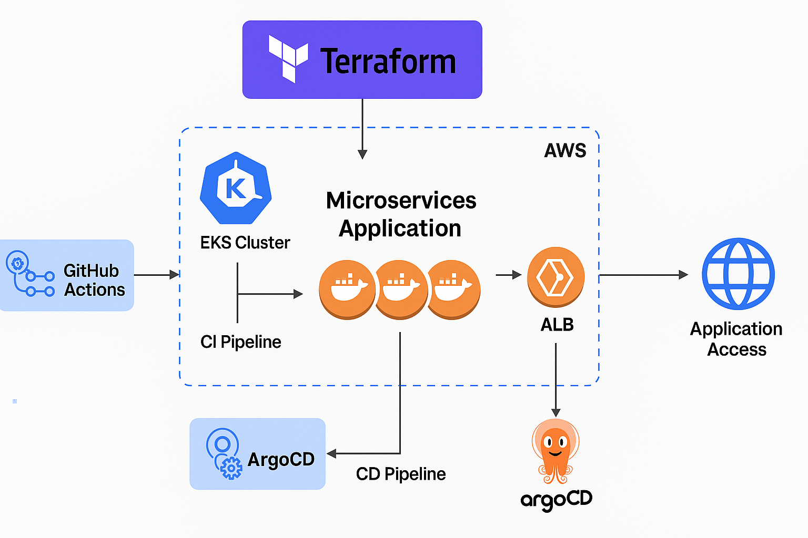

# 🚀 Ultimate DevOps Project – EKS Deployment (Forked & Customized)

### 🧰 Tools Used

`Terraform` • `AWS EKS` • `GitHub Actions` • `ArgoCD` • `Helm` • `Kubernetes` • `Docker`

---

## 📌 Overview

This is a customized implementation of the [Ultimate DevOps Project](https://github.com/abhishekveermalla/ultimate-devops-project) originally created by Abhishek Veermalla. I forked the project and **successfully deployed the full-stack microservices application on an AWS EKS cluster** using modern DevOps tooling such as:

* **Terraform** for infrastructure as code
* **GitHub Actions** for CI/CD pipelines
* **ArgoCD** for GitOps-style continuous deployment

---

## 📸 Architecture Diagram

 
---

## 🔄 End-to-End Workflow

| Stage                     | Tool                           | Description                                             |
| ------------------------- | ------------------------------ | ------------------------------------------------------- |
| **1. Infra Provisioning** | Terraform                      | Creates EKS cluster, IAM roles, VPC, subnets            |
| **2. CI Pipeline**        | GitHub Actions                 | Builds Docker images, pushes to ECR                     |
| **3. CD Pipeline**        | ArgoCD + Helm                  | Deploys to EKS using GitOps principles                  |
| **4. App Deployment**     | Kubernetes                     | Full-stack app with microservices, ingress, autoscaling |
| **5. Monitoring**         | (Optional: Prometheus/Grafana) | Observability stack integration (WIP)                   |

---

## 🔧 Terraform Setup

```bash
cd terraform
terraform init
terraform plan
terraform apply
```

Resources Provisioned:

* EKS Cluster
* Node Groups
* IAM roles and policies
* VPC, Subnets, Internet Gateway
* ECR Repository (for Docker images)

---

## 🧪 GitHub Actions

**CI Pipelines:**

* Triggered on `push` to `main`
* Builds each microservice Docker image
* Pushes to ECR

YAML Path: `.github/workflows/build-and-deploy.yml`

---

## 🚀 ArgoCD GitOps Deployment

**Setup:**

* ArgoCD installed via Helm in `argocd` namespace
* Monitors the `helm-deploy` branch for manifests
* Syncs changes to EKS automatically

To access ArgoCD UI:

```bash
kubectl port-forward svc/argocd-server -n argocd 8080:443
```

---

## 🌐 Application Access

Once deployed, access the app using the ALB/Ingress DNS:

```bash
http://<ALB-DNS>

```

---

## ✅ Achievements & Learning Outcomes

* 🏗️ Built real-world IaC and GitOps workflow from scratch
* ⚙️ Integrated CI/CD using GitHub Actions + ArgoCD
* ☁️ Provisioned and managed secure AWS EKS environments
* 🔍 Understood complete lifecycle: build → test → deploy → sync → run
* 🧠 Strengthened concepts in Terraform modules, Helm charts, and GitOps

---

## 🤝 Credits

Original Project by [Abhishek Veermalla](https://github.com/abhishekveermalla/ultimate-devops-project)

Customized and Deployed by [Abutalib Mahalathy(abunizami)](https://github.com/abunizami)

---
